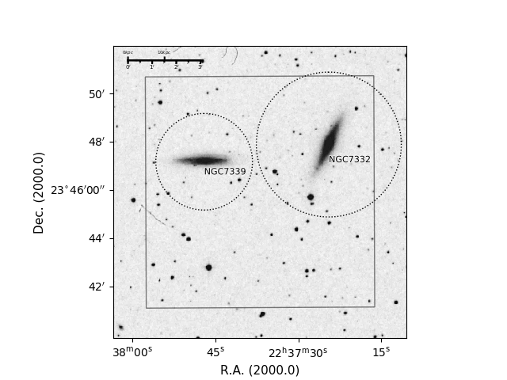

# stomper 
### Automatically generate astronomical footprints

stomper will automatically download and annotate DSS Survey images for use in presentations, posters, or publications.  Generated plots include observational bounding boxes, labels and outline circles for indicated objects, and scale rulers for both sky and target object distance measurements.

## Installation  

1.  Clone this repository
2.  `pip install -r requirements.txt`

## Usage

`python stomper.py -c 'NGC7332',3.1:'NGC7339',2.7 --out=NGC7332_figure.png NGC7332.R.fits ${input_2} ${input_3} ... `

#### Options

*  `-c ${label},${size}:${label2},${size2}...`
    *  `:` separated list of comma-separated pairs consisting of the target names and the size (in arcminutes) of the circles to draw
*  `--out=outfile.png`
    *  output file name
*  `NGC7332.R.fits ${input_2} ${input_3} ...` 
    *  List of input files.  Currently does not check that input images are close on the sky
    
The above example will:
 
 *  read in the input fits file(s)
 *  determine the corners of the input image(s)
 *  download a DSS sky image that exceeds the boundaries of the input fits file(s)
 *  mark the boundaries of the input image(s)
 *  mark dotted circles on the images at the identified locations with the given radii (in arcminutes)
 *  place a scale ruler 
 *  output the image to the specified file.   
 
 
 ### Sample Output
 
 
 
 ## TODO
 
 *  Deliver as python package and make available via pip
 *  Automatically determine object distance and provide scaler ruler in (kpc) at object
 *  Better document input options
 *  Make output image size configurable
 
 
 ### Acknowledgments
 
 This repository includes and makes use of ESO's `footprintfinder.py`, available from here:  http://www.eso.org/~fstoehr/footprintfinder.py
